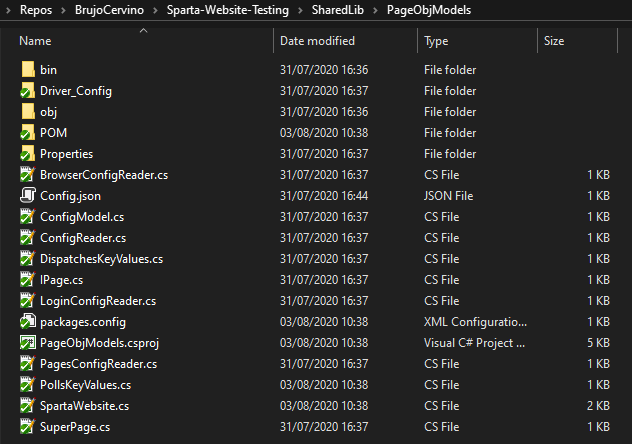
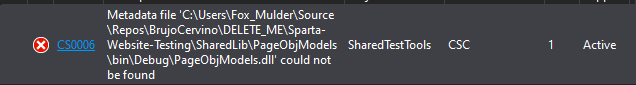
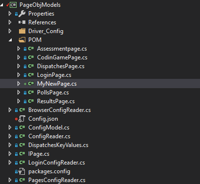
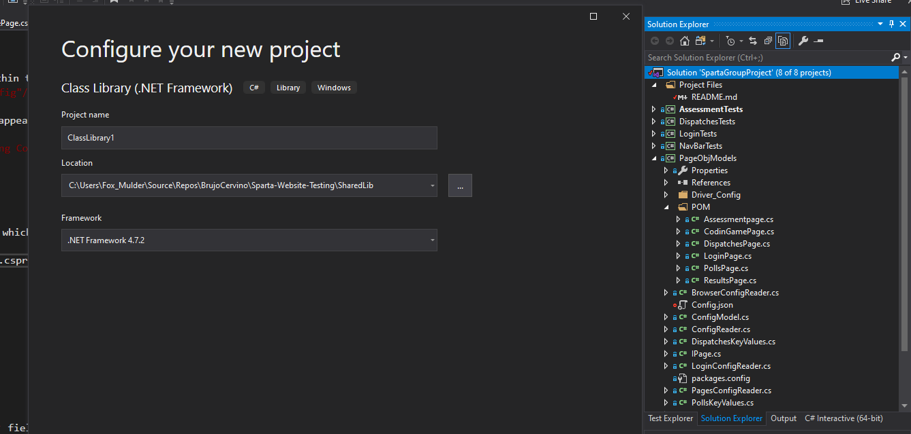
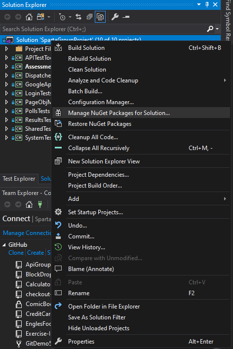
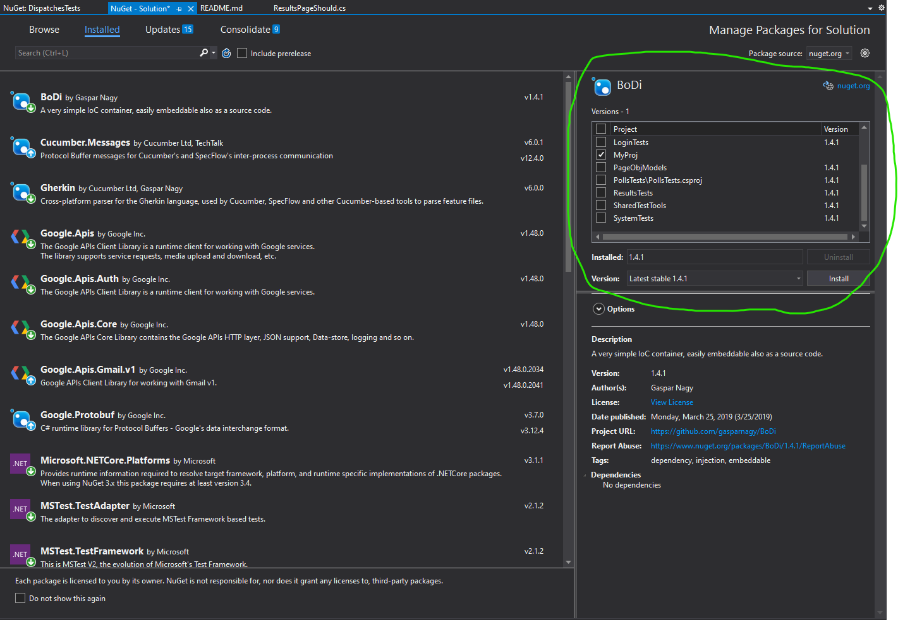
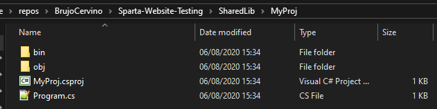
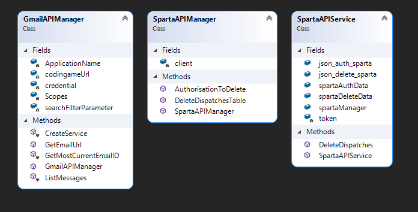

# Sparta-Website-Testing

### A framework for testing Sparta Global's Assessment-tracking and -dispatching website 

## The Project

~ ***[Please refer to the Jira Project here](https://spartaglobal.atlassian.net/secure/RapidBoard.jspa?rapidView=243&projectKey=NG58FNLPRJ&view=planning&issueLimit=100)*** ~
<br/>
**Timeframe**: Mon: Jul-27-2020 - Fri: Aug-7-2020 (2 weeks)
<br/><br/>

### 1 - Goals and Definition of Done<br/><br/>

### 2 - Sprint Breakdown and Reviews<br/><br/>

We planned to have more sprints, but the product owner suggested only 2-- Sprint 1 was planning, Sprint 2 was implementation & execution.

|Sprint Name|Timeframe|
|-|-|
|***Sprint 1 -<br/> Planning***|Mon:Jul-27, Noon<br/> -<br/> Wed:Jul-29, 5PM| 
|***Sprint 2 -<br/> Implementation & Execution***|Thu:Jul-30, 9AM - Fri:Aug-7,11AM|

### 3 - Sprint And Project Retrospectives<br/><br/>

## Code

### Getting Started

***1 ~*** Ensure you have a ```Config.json``` located within the ```/PageObjectModels``` folder

 <br/>

If you skip this step, this compile-time error will appear at least once:

 <br/>

***2 ~*** Add the fields you need into ```Config.json```

### Testing/adding a new page

***1 ~*** Add a new class (this will be your page object model) to the ```PageObjModels``` project which extends ```SuperPage```.



***2 ~*** Add a new .NET Framework class library project (.csproj) to the solution.



***3, Method 1 ~*** Add dependencies to your project: right-click the solution file in the Solution Explorer, then click "manage NuGet packages for solution"



***3.5, Method 1 ~*** Click a package. If other page object model projects depend on it, install it to your project. Repeat for each package.



***3, Method 2 (easier) ~*** Alternatively, duplicate an existing page object model project (.csproj) in the file browser, rename it and add it to a new file. 

   

### How to run the tests

***Tests are to be executed via NUNit***
***1 ~*** Using Visual Studio's *Test Explorer* window, select which test(s) you want to run and run them.<br/> 

### How the Google API is used

We used it to access the email account for the dummy email and extract the CodinGame Url.
Used within the Google API project, to return the url of the CodinGame test.

### Explaining the End To End Tests

*Main purpose*:
Logs onto system -> sends assessment to a generic person -> access API to get CodinGame url -> go to that url -> do the test -> submit test -> check results have been submitted on results page.

### Configuration/serialisation

In order to not leak private company data, this project uses JSON serialisation and deserialisation. 

***~ Config.json ~***

|Element|Subelement|Purpose|
|-|-|-|
|***baseUrl***|none|The base website url ("https://example.doesnotexist.com/") (followed by a slash)|
|***pages***|none|Contains the names of each page ("results") (no slashes needed)|
|***pages***|dispatches|The name of the dispatches page|
|***pages***|polls|The name of the polls page|
|***pages***|results|The name of the results page|
|***loginDetails***|none|Contains the desired (admin for this project) login details for our website|
|***loginDetails***|username|The username for the desired account to log into (admin for this project)|
|***loginDetails***|password|The username for the desired account to log into (admin for this project)|
|***browserLocations***|none|Locations of browsers (and drivers for some browsers)|
|***browserLocations***|firefox|The path of the Firefox *browser* executable|
|***browserLocations***|chrome|The path for the Chrome Selenium *driver* executable|

Workflow for Config.json:

***This file uses [Newtonsoft](https://www.nuget.org/packages/Newtonsoft.Json) for JSON serialisation and deserialisation***.<br/>
***1 ~*** Extend the ```ConfigReader``` class, adding ```public static readonly``` properties.<br/> 
***2 ~*** Copy the JSON code and paste it as a config model class within ```ConfigModel.cs```.<br/>

***~ Credentials.json ~***

[_Generated by Google Mail API, contains authorisation tokens for logging into our dummy Gmail account:_](https://developers.google.com/gmail/api/quickstart/dotnet) - this is a client configuration file.

### Bugs

### Projects

|Name|Purpose|Class diagram¹|
|-|-|-|
|***APITestTools***|Library code for both the Gmail and Dispatches APIs|[]("APITestTools/APITestTools.cd")|                                             
|***AssessmentTests***|Tests for Assessment POM||                                                                      
|***DispatchesTests***|Tests for Dispatches POM||                                                                      
|***GoogleApiTests***|Tests for the Gmail API||                                                                       
|***LoginTests***|Tests for Login POM||                                                                                
|***PageObjModels***|Page Object Models & website models, configuration readers and the config itself||                
|***PollsTests***|Tests for Polls POM||                                                                            
|***ResultsTests***|Tests for Results POM||                                                                            
|***SharedTestTools***|Library tools and helpers for writing tests||                                                   
|***SystemTests***|Tests the End-to-End system (log in -> send & complete test -> check tests are completed in table)||

¹Clicking the picture leads to the class diagram (.cd) file, viewable in Visual Studio

### Agreed conventions (made only when needed)  

♦ ```public```, ```private``` and ```protected``` fields: <br/>

|Access modifier|Naming Convention|Case|Underscore?⬜️✅|
|---------------|-----------------|----|---------------|
|**public**|```public int MyInt;```|```PascalCase```|⬜️|
|**protected**|```protected int myInt;```|```camelCase```|⬜️|
|**private**|```private int _myInt;```|```camelCase```|✅|

♦ For ```public``` variables or properties whose name is a class name, use ```camelCase```: <br>
```public SpartaWebsite spartaWebsite;```<br>
```public SpartaWebsite spartaWebsite {get; set;}```<br>

♦ For (more readable) acronyms, don't use all caps: <br>
```API;``` ->```Api;```<br> 
```URLManager;```->```UrlManager;```<br>

♦ Git branch names - use only lowercase and dashes (avoids the possibility of duplicate branches):
```KieDocs```->```kie-docs``` 